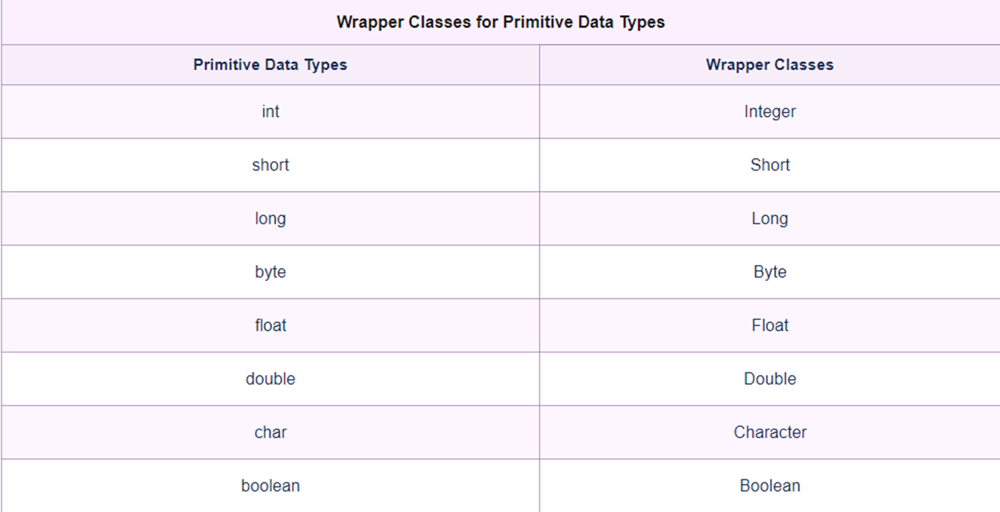
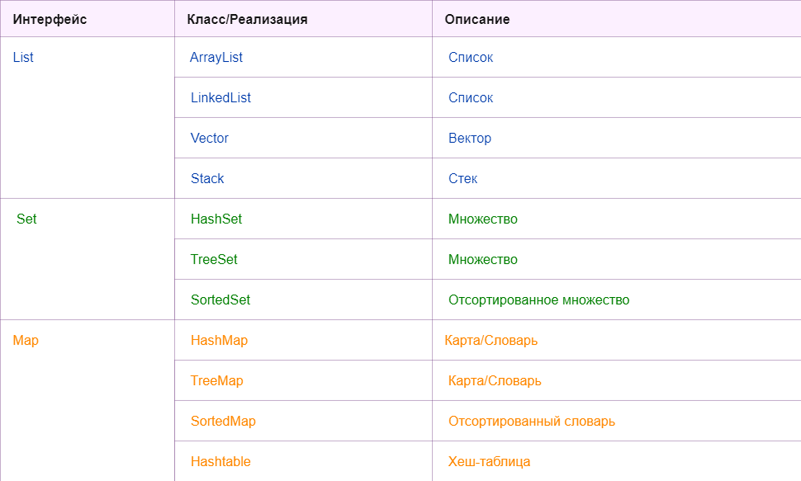
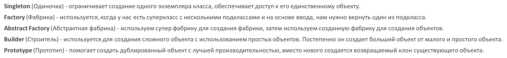
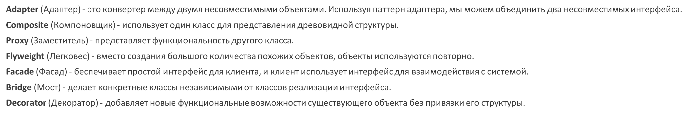
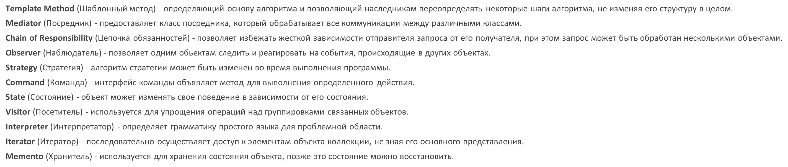

# Java-lessons
Лекции по ЯП Java

## Java-компилятор
- Байт-код - нужен для кроссплатформенности, производительности
- JVM - позволяет выполнять скомпилированный java код на каждой OС
- Сборщик мусора в JVM - автоматически освобождает память(переменные, которые просто забивают ЦП)
- JRE - Java Runtime Environment - среда выполнения java

JVM совместно со стандартными Java-библиотеками образует Среду Выполнения Java(JRE)

```
JDK(Java development kit+инструменты для Java-разработчиков)
->JRE(Java Runtime Environment+набор стандартных Java-библиотек)
->JVM(Java Virtual Machine)
```

## Быстрые команды
- `sout` - `System.out.println("Hello world");`
- `psvm` - `public static void main(){}`

## Форматированный вывод
```java
System.out.format("Hello. My name is %s, i am %d years old ", name, age);
```

`System` - класс, который позволяет разработчику возможность общение с окружающей его средой - ОС

## Константы
Константа объявляется ключевым словом - `final`:
```java
final int LIMIT=5;
```
Название констант в Java - БОЛЬШИМИ БУКВАМИ

## Деление чисел
При делении целового числа на целое получится ЦЕЛОЕ ЧИСЛО
При делении числа с вещественным типом данных получится обычное деление:

```java
int a =5;
int b= 2;
float c=2;
System.out.print(a/b) //2
System.out.print(a/c) //2.5
```

## Приведение типов
При явной конвертации большего типа данных к меньшему происходит потеря данных, лишние биты отбрасываются
```java
int a=258;
byte b=(byte) a; //2
```

## Ввод данных:
```java
Scanner console = new Scanner(System.in);
String name=console.nextLine();
int age = console.nextInt();
```

## Сравнение строк
`.equals` <-> `==` (касается строк) - СРАВНИВАЕТ ПО ЗНАЧЕНИЮ

## Switch
```java
int a=5;
switch (a){
case 1:
    System.out.println("1");
case 2:
    System.out.println("2");
case 3:
    System.out.println("3");
default:
    System.out.println("default");
}
```

## Тернарная операция:
```java
z=(x<y)?x+y:x-y;
```
- `(x<y)` - условие
- `?` - если
- `x+y` - если true
- `x-y` - если false

## ЦИКЛЫ
- `break` - остановить цикл
- `continue` - пропустить круг и перейти к другому кругу

## String
### Классы строк: String, StringBuffer StringBuilder

### class String:
- У класса String не может быть наследников(`final`)
- Экземпляры класса нельзя изменить после создания(`immutable`)
- При изменении строки создаются КОПИИ

```java
String a="111" //1 ячейка
a="222" //2 ячейка
```

### Строки могут быть:
**ЛИТЕРАЛЛАМИ:**
```java
String s1="Hello"
```

**ЛИБО СТРОКОВЫМИ ОБЪЕКТАМИ:**
```java
String s1= new String("Hello")
```

- Строковые литераллы с одинаковым значением указывает на один и тот же объект в памяти
- Строковые объекты с одинаковым значением указывают на разные объекты в памяти

`==` сравнивает адреса в памяти(ссылки)
`.equals` сравнивает значения в памяти

### Методы String:
- `length()` - длина строки
- `concat(String)` - сложение строк(аналог +)
- `indexof(String)` - найти индекс позиции первого элемента в строке(в скобках указываешь символ, диапозон)
- `substring(..)` - получить подстроку(по факту вырезать кусок)

### class StringBuffer:
- Уже изменяемый
```java
StringBuffer sb2 = new StringBuffer("Not empty")
```
- `append` - метод для конкатенации(просто так перезаписать строку не получится!!!)
- `StringBuffer.append` можно добавить любой тип данных
- StringBuffer - изменяемый класс, поэтому при работе с ним не возникает такого же количества мусора в памяти, как со String
- StringBuffer - потокобезопасный класс. Его методы синхронизированы, а экземпляры могут быть использованы несколькими потоками одновременно
- Синхронизированные методы работают медленнее не синхронизированных

### class StringBuilder:
- Отсутствует потокобезопасность
- Более быстрый чем StringBuffer

## Регулярное выражение
Шаблон для строк
```java
String a= "^[a-zA-Z0-9_+&*-]+(?:\\.[a-zA-Z0-9_+&*-]+)*@(?:[a-zA-Z0-9-]+\\.)+[a-zA-Z]{2,7}$";
```
По факту проверка на валидность строки по шаблону(стандарту)
Как пример: регулярное выражение для email/телефона

### Разделение строки:
```java
String[] words = text.split("\\s*(\\s|,|!|\\.)\\s*");
```
Метод split применяется для разделения строки

### Pattern и Matcher:
```java
Pattern pattern = Pattern.compile("bob");
Matcher matcher= pattern.matcher("bob1");
System.out.println(matcher.find()); //true (ищет любое совпадение)
System.out.println(matcher.matches()); //false (смотрит в общем всю строку)
```

```java
Pattern pattern = Pattern.compile("bob");
Matcher matcher= pattern.matcher("aboba aboba aboba");
while(matcher.find()) //ищет любое совпадение
    System.out.println(matcher.group()); // bob bob bob(группирует ответ)
```

- `matcher.matches()` - любое вхождение подстроки в строке должно совладать с регулярным выражение
- `matcher.find()` - полное совпадение строки на регулярное выражение

## Массивы
### Вариант создания:
```java
int nums[]=new int[4];
int[] nums1=new int[5];
int[] nums2={1,2,3,4,5}
int[] nums3=new int[] {1,2,3}
```

## ФУНКЦИИ
Обособленный участок кода, который вызывается по имени.

### Функции бывают:
- Возвращающая без параметров
- Возвращающая с параметрами
- НЕвозвращающая без параметров
- НЕвозвращающая с параметрами

### Перегрузка методов
В программе мы можем использовать методы с одним и тем же именем, но с разными типами и/или количеством параметров.

## Обработка исключений:
`try...catch...finally`

- `try` - потенциальная ошибка
- `catch` - действие, если поймали ошибку
- `finally` - выполнится в любом случае

В начале выполняются все инструкции между операторами try и catch. Если в блоке try вдруг возникает исключение, то обычный порядок выполнения останавливается и переходит к инструкции catch.

При обработке разных типов исключений в блоках catch необходимо использовать уникальные классы ошибок!

Блок finally выполняется в любом случае, возникло ли исключение в блоке try или нет.

- Оператор `throw` - выбросить исключение вручную
- Оператор `throws` - позволяет пробросить обработку исключений верх во стеку

## Enum - перечисления
Набор константных значений

Если энумератор является отдельным классом, то нельзя использовать модификатор `private`

Если enum является частью класса - любой модификатор

### Методы Enum:
- `.values()` предоставляет массив констант энумератора
- `.name()` - имя константы перечисления
- `.ordinal()` - порядковый номер константы энумератора
- `.valueOf()` - позволяет получить значение константы перечисления по его строковому представлению

Поля и методы в перечислениях как и в классах могут иметь модификаторы доступа `private`, `protected`, `default`, `public`, а вот конструкторы в перечислениях всегда будут иметь модификатор `private`

`@Override` - показывает, что будет переопределение от класса-родителя

## Работа с файлами в JAVA
- класс `FileWriter` - создание и запись файла
- класс `FileReader` - считывание файла

```java
FileWriter fw=new FileWriter("MyFile.txt")
FileReader fr=new FileReader("MyFile.txt")
```

При создании объекта FileWriter, если файла нет - создаётся автоматически, если есть - записывает в него

Всегда нужно закрывать поток!!!
```java
fw.close()
fr.close()
```

FileWriter/FileReader - это потоки, их нужно не только "открыть"(то-есть объявить), но и "закрыть"

```java
fw.write("Hello") - запись в текстовый файл(перезапись)
```

Записывать в текстовый файл можно только текст!!!

```java
fw.append("sads") - дописать файл
```

`ALT+Insert` - автогенерация

## Абстрактные классы
Абстрактные классы - это принцип ООП, согласно которому при проектировании классов и создании объектов необходимо выделять только главные свойства сущности, и отбрасывать второстепенные.

**НЕЛЬЗЯ СОЗДАВАТЬ ОБЪЕКТ АБСТРАКТНОГО КЛАССА!!!**

Класс является абстрактным, если хотя бы один из его методов является абстрактным!

Если метод помечен словом `abstract`, каждый класс-наследник должен его реализовать или быть объявленным как абстрактный. Иначе компилятор выбросит ошибку.

Абстрактные классы и перечисления похожи, но интерфейс описывает только поведение, у него есть состояния, а у абстрактного класса состояние есть: он описывает и то, и другое.

## ИНТЕРФЕЙСЫ JAVA
Интерфейсы позволяют делать множественную реализацию

Чтобы класс применил интерфейс, надо использовать ключевое слово `implements`

### Особенности интерфейсов:
- По умолчанию модификатор методов в интерфейсах - `public`
- Если класс применяет интерфейс, то он должен реализовать все методы этого интерфейса
- Нельзя создавать объекты интерфейса

### Приведение к общему типу:
```java
Printable printable = new Book("Java.Complete Reference", "ABRAM");
printable.print();
printable=new Journal("POLICY");
printable.print();
```

### Модификатор default:
- Модификатор `default` позволяет методу интерфейса иметь базовую реализацию
- Этот метод необязательно реализовывать в классе

### Статические методы и константы:
- В интерфейсе могут быть статичные методы
- В интерфейсах могут быть определены статические константы

### Множественная реализация интерфейсов:
```java
interface Printable{
    // методы
}
interface Searchable{
    // методы
}
class Book implements Printable, Searchable{
    // реализация методов
}
```

### Наследование интерфейсов:
ИНТЕРФЕЙСЫ МОГУТ НАСЛЕДОВАТЬ ДРУГИЕ ИНТЕРФЕЙСЫ
```java
interface BookPrintable extends Printable{
    void paint();
}
```

- Интерфейс может быть вложенным
- Интерфейсы могут использоваться как параметры методов и как результат методов(возвращаемая значение)

### Механизм обратного вызова
- `callback` - действие в ответ на какое-то действие

### Одноразовый класс(Анонимный класс)

```java
Button button = new Button(new EventHandler(){
    public void execute(){
        System.out.println("Пуск");
    }
});
```

### Отличие классов от интерфейсов
- Вы не можете создать экземпляр интерфейса
- В интерфейсе не содержаться конструкторы
- Все методы в интерфейсе абстрактные
- Интерфейс не может содержать поля экземпляров. Поля, которые могут появиться в интерфейсе, обязаны быть объявлены и статическими, и final
- Интерфейс не расширяется классом, он реализуется классом
- Интерфейс может расширить множество интерфейсов


## Обобщение JAVA(Generics)
Обобщение позволяют уйти от жесткого определения используемых типов

### Пример обобщения

```java
public static void main(String args[]){
    Account<String> acc1 = new Account<String>("123123", 123); //создаём объект
    String accID=acc1.getId(); //получаем id
    System.out.println(accID); //выводим id

    //тоже самое, но с другим типом данных
    Account<Integer> acc2 = new Account<Integer>(123123, 123);
    Integer accID1=acc2.getId();
    System.out.println(accID1);
}

static class Account<T> { //создание обощенного класса
    private T id;
    private int sum;
    Account(T id, int sum){
        this.id=id;
        this.sum=sum;
    }
    public T getId(){return id;}
    public int getSum(){return sum;}
    public void getId(int sum){this.sum=sum;}
}
```
### Интерфейсы также могут быть обобщёнными
```java
public static void main(String args[]){
        Accountable<String> acc1 = new Account("asfs", 235423);
        Account acc2 = new Account("123", 577);
        System.out.println(acc1.getID());
        System.out.println(acc2.getID());

    }
    
    interface Accountable<T>{
        T getID();
        int getSum();
        void setSum(int sum);
    }
    
    static class Account implements Accountable<String>{
        private String id;
        private int sum;
        
        Account(String id, int sum){
            this.id=id;
            this.sum=sum;
        }
        @Override
        public String getID() {
            return id;
        }

        @Override
        public int getSum() {
            return sum;
        }

        @Override
        public void setSum(int sum) {
            this.sum=sum;
        }
    }
```

### Пример использования обобщенного интерфейса
```java
class Account<T> implements Accoutable<T>{} //используем обобщённый интерфейс
class Account1<T,S,A> implements Accoutable<T>{}
```
### Помимо обобщенных классов и интерфейсов, обобщёнными могут быть и методы
```java
public <T> void print(T[] items){}

//вызов этого метода будет такой
// <String>print(23,23,23);
```

### Большой пример

### Объяснение примера
**В данном случае класс Transaction, который представляет операцию перевода средств между двумя счетами, типизирован параметром Т, у которого в качестве ограничения установлен класс Account. При создании объекта Transaction в его конструктор передаются два объекта Account два счета, между которыми надо осуществить перевод, и сумма перевода.**
По простому:Позволяет наложить ограничения на использование типов данных(будет возможно подставить класс account или его дочерних классов)
### В необобщённом классе может быть обобщённый конструктор

```java
class Account {
    private String id;
    private int sum;
    
    <T>Account(T id, int sum){
        this.sum=sum;
        this.id=id;
    }
}
```
### Множественные ограничения
```java
class Person{}
interface Accountable{}
class Transaction<T extends Person & Accountable>{}
```
### Наследование обобщённого класса
```java
class DepositAccount<T> extends Account<T>{
    DepositAccount(T id){
        super(id);
    }
}
```
### Если класс наследник имеет свои обобщённые параметры, то указываются типы родителей и типы наследника
```java
class DepositAccount<T,S> extends Account<T>{} //T - тип родителя(Account), а S - тип наследника(DepositAccount)
```
**Пример создания объекта**
```java
DepositAccount<Integer, String> depositAccount = new DepositAccount(20, "Том"); //Integer - тип для родителя, а String - тип для наследника
```
### ALT+INSERT - генерация конструкторов, геттеров, сеттеров и т.д.

## Классы-обёртки
### Обёртка - специальный класс, который хранит внутри себя значение примитива


**Объекты классов-обёрток являются не изменяемыми.**
**Они создают копии, но не изменяются**

**Попытка передать массив примитивов методу, который принимает в качестве входных данных массив объектов, вызовет ошибку компиляции**
### ВЫВОД
- **Примитивы:** имеют преимущество в производительности
- **Обёртки:** Позволяют не нарушать принцип "всё является объектом", благодаря чему числа, символы и булевы значения не выпадают из этой концепции

## Records
### **Records** представляют классы, которые предназначены для создания контейнеров неизменяемых данных
```java
record Person(String name, int age){
    //something
}
```
### Практический пример:
```java
package org.example;
public class Main {
    public static void main(String[] args) {
            Person tom = new Person("Tom", 36);
            System.out.println(tom.toString());
        }

        record Person(String name, int age){}
    }
```
- Records определяются с помощью ключевого слова record, за которым следует название записи.
- Также будет создаваться конструктор с двумя параметрами name и age. А каждого поля автоматически будет создаваться getter.
- И также автоматически будут создаваться методы equals, hasCode и toString

### Канонический конструктор
```java
record Person (String name, int age){}
//По факту создала конструктор
Person(String name, int age){
    this.name=name;
    this.age=age;
}
```
<h4>Канонический конструктор принимает параметры, которые называются также, как и поля record, и передаёт полям значения соответствующих параметров. Но его можно переопределить!</h4>
<h4>Пример:</h4>

```java
package org.example;
public class Main {
public static void main(String[] args) {
Person tom = new Person("Tom", 36);
System.out.println(tom.toString());
}

        record Person(String name, int age){
            public String name(){return name;}
            public String toString(){return String.format("Person %s, Age %d", name, age);}
        }
    }
```
<h3>Важно!</h3>
<h4>Мы НЕ можем:</h4>
- Наследовать запись record от других классов<br>
- Нельзя наследовать классы от record<br>
- Классы record не могут быть абстрактным<br>

<h4>Мы можем:</h4>
- Классы record могут реализовать интерфейсы

## Коллекции
**Map** - словарь, коллекция с парой Ключ-Значение

### Все виды коллекций


### Итератор - объект, позволяющий пройтись по любому виду коллекций

```java
import java.util.Iterator;

Iterator<String> iterator=set.iterator();
while(iterator.hasNext()){
    String text = iterator.next();
 }
```

**Со словарями реализация будет отличаться:**

```java
package org.example;

import java.util.HashMap;
import java.util.Iterator;
import java.util.Map;

public class Main {
    public static void main(String[] args) {
        Map<String, String> map = new HashMap<String, String>();
        map.put("first","Mama");
        map.put("second","Mila");
        map.put("third","Ramu");

        Iterator<Map.Entry<String, String>> iterator = map.entrySet().iterator();

        while (iterator.hasNext()){
            Map.Entry<String, String> pair = iterator.next();
            String key=pair.getKey();
            String value = pair.getValue();
            System.out.println(key+":"+value);
        }
        }
    }
```

<h4>Ключевое отличие ArrayList от массивов в том, что ArrayList не имеют ограничений по размеру(т.е. они динамические), и есть дополнительные методы для очистки, добавления и т.д.</h4>

**Arrays.asList() - преобразование массива к листу<br>
cats.toArray() - преобразования листа к массиву**

### Часть методов вызывается из класса Collections

```java
Collections.sort(); //Сортировка
Collections.shuffle(); //Перемешать элементы коллекции
Collections.unmodifiableList(); //Сделать коллекцию неизменяемой(прям кремень)
```

## LinkedList - двусвязный список
<b>У каждого элемента помимо тех данных, которые он хранит, имеется ссылка на предыдущий и следующий элемент.</b> <br>
<b>Большинство методов такие же как и у ArrayList</b>
<br>
### Примеры методов
```java
addFirst() //добавить элемент в начало списка 
addLast()  //добавить элемент в конец списка
peekFirst() //получить первый элемент списка
peekLast() //получить последний элемент списка
pollFirst() //возвращает и удаляет первый элемент списка
pollLast() ////возвращает и удаляет последний элемент списка
```
### Выгода LinkedList
<b>Выгода LinkedList - в работе с серединой списка.<br>Допустим на вставку миллиона элементов в начало списка ArrayList потребуется 43 секунды, а в LinkedList справится за 0,1 секунды!</b>

## Vector
### Как ArrayList, только синхронизирован
<b>Синхронизация относится к многопоточности. Синхронизированный блок кода может быть выполнен только одним потоком одновременно.</b>

## Stack(Очередь) LIFO(LAST IN - FIRST OUT)
### Методы
```java
empty() // проверка на "пустотелость" стека
peek() // возвращает элемент сверху стека, но не удаляет
pop() // возвращает элемент сверху стека и удаляет
push(Object element) // вталкивает элемент в стек, также возвращается
search(Object element) // ищет элемент в стеке. Если нашёл - вернёт смещение от вершины стека, иначе вернёт 1
```
### Пример работы с Stack:
```java
package org.example;
import java.util.EmptyStackException;
import java.util.Stack;
public class Main {
    static void showpush(Stack st, int a) {
        st.push(new Integer(a));
        System.out.println("Поместить("+a+")");
        System.out.println("Стек: "+st);
    }
    static void showpop(Stack st){
        System.out.println("Выкинуть -> ");
        Integer a = (Integer) st.pop();
        System.out.println(a);
        System.out.println("Стек: "+st);
    }
    public static void main(String[] args) {
        Stack st = new Stack();
        System.out.println("Стек: "+st);
        showpush(st,42);
        showpush(st,69);
        showpush(st,99);
        showpop(st);
        showpop(st);
        showpop(st);
        try {
            showpop(st);
        } catch (EmptyStackException e){
            System.out.println("Пустой стек");
        }
        }
    }
```

## ArrayDeque - двоичная очередь, работает как LIFO, так и FIFO
## Set/HashSet/TreeSet - Множества
<b>HashSet - хранит элементы в произвольном порядке, но зато быстрее ищет.<br>
TreeSet - хранит элементы отсортированными, но скорость меньше</b>
### Пример:
```java
package org.example;
import java.util.EmptyStackException;
import java.util.HashSet;
import java.util.Iterator;
import java.util.Stack;
public class Main {
    public static void main(String[] args) {
        HashSet<String> h=new HashSet<String>();
        h.add("USA");
        h.add("India");
        h.add("Russia");
        h.add("USA");
        System.out.println(h);
        System.out.println("List contains USA or not:" +h.contains("USA"));
        h.remove("India");
        System.out.println("List after removing India:" +h);
        System.out.println("Iterating over list:");
        Iterator<String> i = h.iterator();
        while ((i.hasNext()))
            System.out.println(i.next());
    }
}
```
## Какие есть виды map(Словари) в Java
- HashMap - хранит значения в произвольном порядке, ног позволяет быстро искать элементы карты.
- LinkedHashMap - хранит значения в порядке добавления
- TreeMap - сама сортирует значения по заданному критерию<br>
Метод put добавляет пару "ключ-значение" в словарь.<br>
Если попытаться добавить другое значение с таким же ключом, то данные перезапишутся

<b>Доступ к значениям осуществляется по ключу, используется метод get</b>

```java
containsKey() // проверка на существования ключа
containsValue() // проверка на существования значения
keySet() // получить все ключи
values() // получить все значения
putAll() // объединение двух словарей в один
```
### Пример работы:
```java
package org.example;
import com.sun.source.tree.Tree;
import java.util.*;
public class Main {
    public static void main(String[] args) {
        TreeMap tm = new TreeMap<>();
        tm.put("Заря", new Double(3434.34));
        tm.put("Абрам", new Double(36734.34));
        tm.put("Миша", new Double(376934.34));
        Set set = tm.entrySet();
        Iterator i = set.iterator();
        while (i.hasNext()){
            Map.Entry me = (Map.Entry)i.next();
            System.out.println(me.getKey()+": ");
            System.out.println(me.getValue());
        }
        System.out.println();
        double balance = ((Double)tm.get("Заря")).doubleValue();
        tm.put("Заря", new Double(balance+1000));
        System.out.println("Новый баланс Зари: "+tm.get("Заря"));
    }
}
```

## Встроенные функциональные интерфейсы для лямбд

### Predicate<T>
<b> Проверяет соблюдение некоторого условия. Если оно соблюдается, то возвращается true.</b>

```java
public interface Predicate<T>{
    boolean test(T t);
}
```

### BinaryOperator<T>
<b>Принимает в качесвте параметра два объекта типа T, выполняет над ними бинарную операцию и возвращает ее результат в виде объекта типа T</b>

```java
public interface BinaryOperator<T>{
    T apply(T t1, T t2);
}
```

### UnaryOperator<T>
<b>Принимает в качестве параметра объект типа T, выполняет над ними операции и возвращает результат операций в виде объекта типа T</b>

```java
public interface UnaryOperator<T>{
    T apply(T t);
}
```

### Function<T,R>
<b>Функциональный интерфейс, представляет функцию перехода от объекта типа T к объекту типа R</b>
```java
public interface Function<T, R>{
    R apply(T t);
}
```

### Consumer<T>
<b>Выполняет некоторое действие над объектом типа T, при этом ничего не возвращая</b>

```java
public interface Consumer<T>{
    void accept(T t);
}
```

### Supplier<T>
<b>Не принимает никаких аргументов, но должен возвращать объект типа T</b>

```java
public interface Supplier<T>{
    T get();
}
```


## Паттерны Проектирования
### Паттерны проектирования - готовые к использованию решения часто возникающих в программировании задач.
### Типы паттернов:
 - Порождающие
 - Структурные
 - Поведенческие

<b>Порождающие паттерны предоставляют механизмы инициализации, позволяя создавать объекты удобным способом.<br>Структурные паттерны определяют отношения между классами и объектами, позволяя им работать совместно.<br>Поведенческие паттерны используются для того, чтоб упростить взаимодействие между сущностями.</b>

### Порождающие паттерны


### Структурные паттерны


### Поведенческие паттерны



## Принципы разработки ПО
### 1) DRY - Don't repeat yourself - "Не повторяйтесь"

- <b>Избегайте копирования кода.
- Выносите общую логику
- Прежде чем добавлять функционал, проверьте в проекте, может, он уже создан
- Константы</b>

### 2) KISS - Keep it stupid simple - "Пусть всё будет простым до безобразия"

- <b>Ваши методы должны быть небольшими(40-50 строк)
- Каждый метод решает одну проблему
- При модификации кода в будущем не должно возникнуть трудностей
- Система работает лучше всего, если она не усложняется без надобности
- Не устанавливайте целую библиотеку ради одной функции из неё
- Не делай того, что не просят
- Писать код необходимо надёжно</b>

### 3) BDUF - Big design up front - "Масштабное проектирвоание прежде всего"

<b>Он утверждает, что большую часть времени, отведённого на проектирование приложения, вы тратите далеко не на написание кода</b> 
- <b>Прежде чем переходить к реализации, убедитесь, что все продумано
- Разработчик должен сначала завершить проектирование. После этого проект можно реализовать.
- Разделите требования на несколько этапов, определите приоритеты, начинайте с этапа с наивысшим приоритетом
- Обсудите архитектуру проекта с командой и другими людьми, которые участвуют в проекте до старта</b>