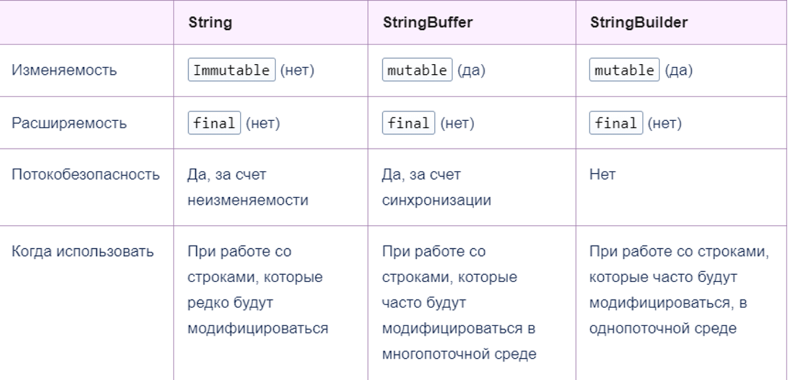

# Java-lessons
My java lessons

Java-компилятор
Байт-код - нужен для кроссплатформенности, производительности
JVM-позволяет выполнять скомпилированный java код на каждой OС
Сборщик мусора в JVM - автоматически освобождает память(переменные, которые просто забивают ЦП)
JRE-Java Runtime Environment - среда выполнения java

JVM совместно со стандартными Java-библиотеками образует Среду Выполнения Java(JRE)

JDK(Java development kit+инструменты для Java-разработчиков)->JRE(Java Runtime Environment+набор стандартных Java-библиотек)->JVM(Java Virtual Machine)
sout - System.out.println("Hello world");
psvm - public static void main(){}

Форматированный вывод
System.out.format("Hello. My name is %s, i am %d years old ", name, age);

System - класс, который позволяет разработчику возможность общение с окружающей его средой - ОС

Константа объявляется ключевым словом - final:
final int LIMIT=5;
Название констант в Java-БОЛЬШИМИ БУКВАМИ

При делении целового числа на целое получится ЦЕЛОЕ ЧИСЛО
При делении числа с вещественным типом данных получится обычное деление:

int a =5;
int b= 2;
float c=2;
System.out.print(a/b)//2
System.out.print(a/c)//2.5

При явной конвертации большего типа данных к меньшему происходит потеря данных, лишние биты отбрасываются
int a=258;
byte b=(byte) a; //2

Ввод данных:
Scanner console = new Scanner(System.in);
String name=console.nextLine();
int age = console.nextInt();

.equals <-> ==(касается строк) - СРАВНИВАЕТ ПО ЗНАЧЕНИЮ

switch:

int a=5;
switch (a){
case 1:
System.out.println("1");
case 2:
System.out.println("2");
case 3:
System.out.println("3");
default:
System.out.println("default");

Тернарная операция:
z=(x<y)?x+y:x-y;
(x<y) - условие
?-если
x+y - если true
x-y - если false

ЦИКЛЫ
break - остановить цикл
continue - пропустить круг и перейти к другому кругу

String
Классы строк: String, StringBuffer StringBuilder
class String:
У класса String не может быть наследников(final) и экземпляры класса нельзя изменить после создания(immutable)
При изменении строки создаются КОПИИ
String a="111" //1 ячейка
a="222" //2 ячейка
СТРОКИ МОГУТ БЫТЬ ЛИТЕРАЛЛАМИ:
String s1="Hello"
ЛИБО СТРОКОВЫМИ ОБЪЕКТАМИ:
String s1= new String("Hello")
Строковые литераллы с одинаковым значением указывает на один и тот же объект в памяти
Строковые объекты с одинаковым значением указывают на разные объекты в памяти

== сравнивает адреса в памяти(ссылки)
.equals сравнивает значения в памяти

length() - длина строки
concat(String) - сложение строк(аналог +)
indexof(String) - найти индекс позиции первого элемента в строке(в скобках указываешь символ, диапозон)
substring(..) - получить подстроку(по факту вырезать кусок)

class StringBuffer:
Уже изменяемый
StringBuffer sb2 = new StringBuffer("Not empty")
append - метод для конкатенации(просто так перезаписать строку не получится!!!)
StringBuffer.append можно добавить любой тип данных

StringBuffer - изменяемый класс, поэтому при ра~~~~боте с ним не возникает такого же количества мусора в памяти, как со String
StringBuffer - потокобезопасный класс. Его методы синхронизированы, а экземпляры могут быть использованы несколькими потоками одновременно
Синхронизированные методы работают медленнее не синхронизированных

class StringBuilder:
Отсутствует потокобезопасность

Регулярное выражение
Шаблон для строк
String a= "^[a-zA-Z0-9_+&*-]+(?:\\.[a-zA-Z0-9_+&*-]+)*@(?:[a-zA-Z0-9-]+\\.)+[a-zA-Z]{2,7}$";
По факту проверка на валидность строки по шаблону(стандарту)
Как пример: регулярное выражение для email/телефона

String[] words = text.split("\\s*(\\s|,|!|\\.)\\s*");
Метод split применяется для разделения строки

Pattern pattern = Pattern.compile("bob");
Matcher matcher= pattern.matcher("bob1");
System.out.println(matcher.find()); //true (ищет любое совпадение)
System.out.println(matcher.matches()); //false (смотрит в общем всю строку)

Pattern pattern = Pattern.compile("bob");
Matcher matcher= pattern.matcher("aboba aboba aboba");
while(matcher.find()) //ищет любое совпадение
System.out.println(matcher.group()); // bob bob bob(группирует ответ)

matcher.matches() - любое вхождение подстроки в строке должно совладать с регулярным выражение 
matcher.find() - полное совпадение строки на регулярное выражение

**Массивы**
Вариант создания:
int nums[]=new int[4];
int[] nums1=new int[5];

int[] nums2={1,2,3,4,5}
int[] nums3=new int[] {1,2,3}

ФУНКЦИИ
Обособленный участок кода, который вызывается по имени.
Функции бывают: 
Возвращающая без параметров
Возвращающая с параметрами
НЕвозвращающая без параметров
НЕвозвращающая с параметрами

Перегрузка методов - в программе мы можем использовать методы с одним и тем же именем, но с разными типами и/или количеством параметров.

Обработка исключений:
try...catch...finally

try - потенциальная ошибка
catch - действие, если поймали ошибку
finally - выполнится в любом случае

в начале выполняются все инструкции между операторами try и catch. Если в блоке try вдруг возникает исключение, то обычный порядок выполнения останавливается и переходит к инструкции catch.

при обработке разных типов исключений в блоках catch необходимо использовать уникальные классы ошибок!

Блок finally выполняется в любом случае, возникло ли исключение в блоке try или нет.

Оператор throw-выбросить исключение вручную
оператор throws-позволяет пробросить обработку исключений верх во стеку

Enum- перечисления
набор константных значений

Если энумератор является отдельным классом, то нельзя использовать модификатор private

Если enum является частью класса-любой модификатор
.values() предоставляет массив констант энумератора
.name() - имя константы перечисления
.ordinal() - порядковый номер константы энумератора
.valueOf()-позволяет получить значение константы перечисления по его строковому представлению

Поля и методы в перечислениях как и в классах могут иметь модификаторы доступа private, protected, default, public, а вот конструкторы в перечислениях всегда будут иметь модификатор private

@Override - показывает, что будет переопределение от класса-родителя

Работа с файлами в JAVA
класс FileWriter - создание и запись файла
класс FileReader - считывание файла

FileWriter fw=new FileWriter("MyFile.txt")
FileReader fr=new FileReader("MyFile.txt")

При создании объекта FileWriter, если файла нет - создаётся автоматически, если есть - записывает в него
Всегда нужно закрывать поток!!!
fw.close()
fr.close()
FileWriter/FileReader - это потоки, их нужно не только "открыть"(то-есть объявить), но и "закрыть"
fw.write("Hello") - запись в текстовый файл(перезапись)
Записывать в текстовый файл можно только текст!!!
fw.append("sads") - дописать файл

ALT+Insert - автогенерация

Абстрактные классы

Абстрактные классы - это принцип ООП, согласно которому при проектировании классов и создании объектов необходимо выделять только главные свойства сущности, и отбрасывать второстепенные.

НЕЛЬЗЯ СОЗДАВАТЬ ОБЪЕКТ АБСТРАКТНОГО КЛАССА!!!
Класс является абстрактным, если хотя бы один из его методов является абстрактным!
Если метод помечен словом abstract, каждый класс-наследник должен его реализовать или быть объявленным как абстрактный. Иначе компилятор выбросит ошибку
Абстрактные классы и перечисления похожи, но интерфейс описывает только поведение, у него есть состояния, а у абстрактного класса состояние есть: он описывает и то, и другое

ИНТЕРФЕЙСЫ JAVA

Интерфейсы позволяют делать множественную реализацию
